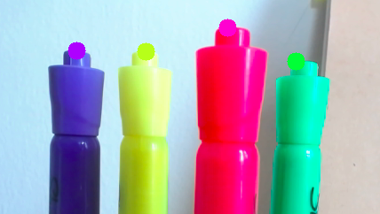

# Paint with OpenCV
Object and color detection project using OpenCV and my webcam. 

Using Object Detection and Tracking, the user is allowed to “paint” as the tracker marks the object on screen.

Read more about the process [here](https://www.notion.so/It-is-actually-quite-difficult-to-make-the-logo-on-screen-101af58622dc410cab8629c08742322a)

Mask to isolate each highlighter:

